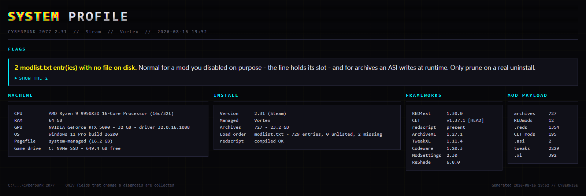
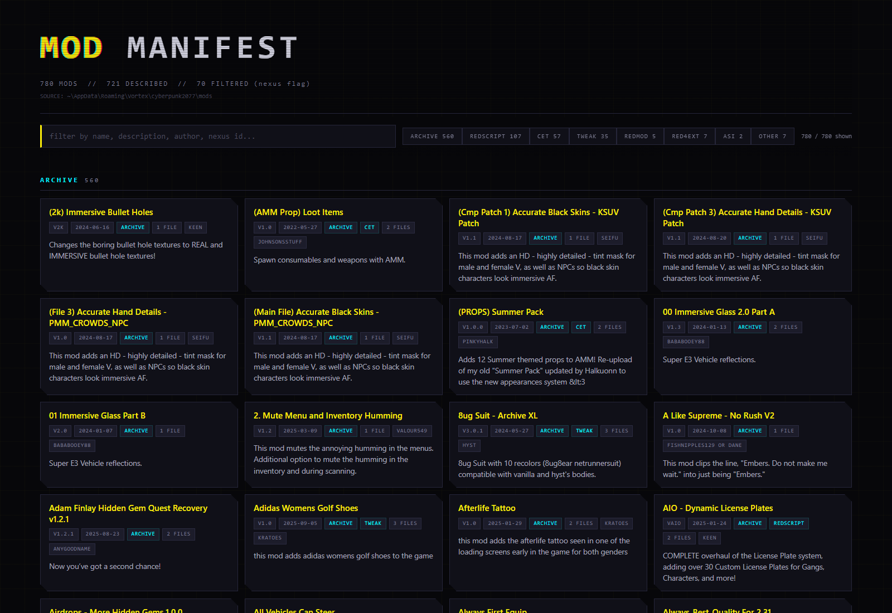
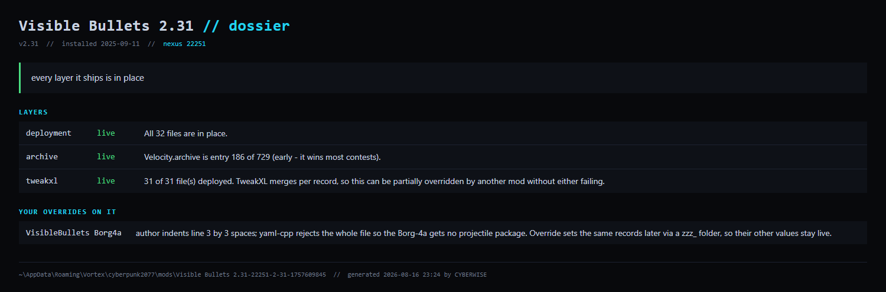
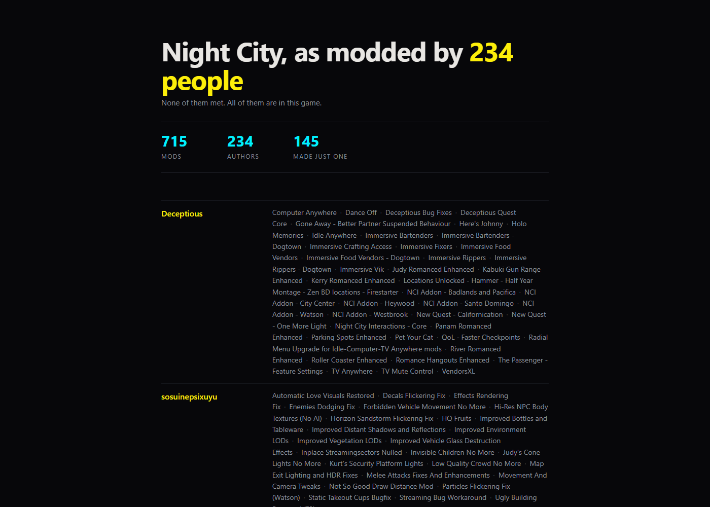
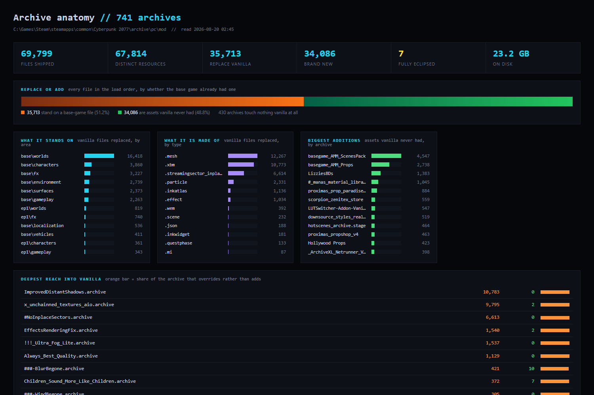
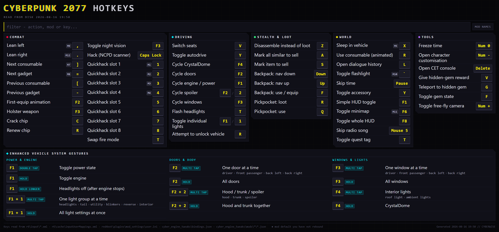
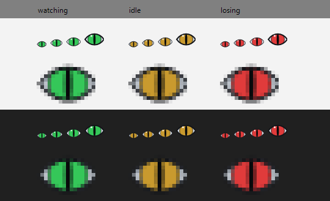

# What Cyberwise produces

Four things it makes, on a real install. Every number below came off one
850-mod Vortex setup — nothing here is a mock-up, and nothing was retouched
beyond trimming empty space at the bottom of a page.

Each page is a **single self-contained HTML file**: no fonts, no scripts, no
images loaded from anywhere else. It works offline, off a USB stick, or
attached to a forum post, and it will still work in five years.

---

## System profile

The answer to *"it's broken"* when there is no other detail to go on.



**Flags come first, before the facts.** A report that leads with hardware makes
you hunt for the problem; this one names what is likely to be wrong at the top
and puts the evidence underneath. Every flag states the symptom *and* the
reason, and carries the items it counted — the "2 modlist.txt entries with no
file on disk" flag expands to name both, because a flag saying *60 archives are
unlisted* is unactionable until you know which 60, and **seeing the list is also
how a wrong flag gets caught**.

Note what that flag actually says: two missing entries are **normal** for a mod
you disabled on purpose. A profiler that flagged them as damage would be worse
than one that stayed quiet.

Only fields that change a diagnosis are collected. VRAM against total texture
volume, pagefile, drive type, framework versions, load-order health, whether
redscript last compiled — that last one because redscript is an all-or-nothing
gate, and if it failed, every `.reds` mod on the install is silently off with no
sign in the game at all. Motherboard model explains nothing about a mod, so it
is not there.

The install path in the footer is **redacted by default**, because the companion
markdown output exists to be pasted into a Discord thread.

```powershell
tools\New-SystemProfile.ps1 -GameRoot '<path>'
```

---

## Mod manifest

Every mod on the install, what it deploys, where it came from, and what it does.



780 mods shown here, 70 filtered out by `-HideNSFW`. The chips along the top are
live filters over the payload kinds — 560 archives, 107 redscript, 57 CET, 35
tweak, 5 REDmod, 7 RED4ext, 2 ASI, 7 other — and the search box filters by name,
description, author or Nexus id as you type. The data is embedded as JSON and
rendered client-side, which is what keeps search instant on a load order this
size.

**Most of it works with no credentials.** A manager that installed from Nexus
encodes `<Display Name>-<NexusID>-<version>-<timestamp>` into the staging folder
name, which yields the name, a working link and the install date for free. An
API key adds the one-line descriptions, the author and the real adult-content
flag; those are cached, so re-runs cost nothing. **This screenshot was generated
with zero network calls** — 683 cached entries, none fetched.

Folders that do not match the convention are still listed from the folder name
alone. A mod dropped from an inventory is a mod nobody knows they have.

`SOURCE:` is redacted to `~\AppData\Roaming\Vortex\...`. A manifest exists to be
handed to someone else, and nobody proof-reads a header before pasting.

```powershell
tools\New-ModManifest.ps1 -StagingRoot '<staging root>' -HideNSFW
```

---

## Mod dossier

One mod, every layer it ships, and which parts are actually doing anything.



*"I installed this — is it working?"* is the most common question on a modded
install, and nothing answers it, because **a mod is not one thing.** It is up to
nine payloads deployed to nine different places, and each fails in its own silent
way: an archive that loses every file it contests, a `.reds` that is on disk but
not in the compiled bundle, a CET folder with no `init.lua`, a `.yaml` that never
loaded. A single verdict for all nine would be a lie, so this reports per layer —
and says `unknown` where the disk genuinely cannot tell you.

It learns what the mod *should* deploy by walking the mod's own staging folder,
so the footprint is exact rather than guessed from its category or its page. The
archive line is the useful one here: **entry 186 of 729** says this mod wins most
of what it contests, which is a fact about load order that no mod page can tell
you.

The bottom section is the part that only exists because this repo tracks it — an
override *you* made against this mod's file, with the reason recorded at the time
you made it. When the author ships an update, that is the thing that silently
keeps winning, and this is where it stops being invisible.

```powershell
tools\New-ModDossier.ps1 -Mod 'Visible Bullets' -GameRoot '<path>'
```

## Mod credits

234 people, none of whom met, all of whom are in this game.



Every other report here is a diagnostic. This one is not for debugging anything
— it is the one page you could show somebody who does not mod. A heavily modded
install is the work of hundreds of people, and the only place that usually shows
up is a folder listing full of version numbers and hashes.

Two things it has to keep getting right, and both are about honesty rather than
crashes:

**Distinct mods, not staging folders.** A FOMOD with options installs as several
folders sharing one Nexus id. Counting folders read 798 where the truth was 715,
and printed one mod's title four times in its author's line — the flattering
direction of error, and the one a reader cannot check.

**Adult mods are omitted by default, and the omitted count is printed.** The
page is built to be shown, so the default is the one that does not surprise
somebody mid-stream; but silently dropping people from a credits list is its own
unkindness. `-ShowAdult` includes everything.

```powershell
tools\New-ModCredits.ps1 -StagingRoot '<staging>' -Md credits.md
```

---

## Archive anatomy

What the archive layer replaces, what it invents, and where it concentrates.



The distinction that makes this page possible is **replace versus add**. An
archive hash the vendored base-game path table knows is an override — the game
shipped that file and this mod is standing on top of it. A hash it does not know
is an asset the mod invented. Without the path table those two are
indistinguishable, and they mean opposite things: 34,086 new assets is a library
of content, 35,713 overrides is the surface that can break on the next patch.

**Unresolved is not unknown.** The table covers 99.97% of base game and Phantom
Liberty, which is the only reason the "brand new" column can be trusted — and
the reason that caveat is printed on the page rather than left to the reader.

The bottom half is precedence: which archives reach deepest into vanilla, and
which lose files to something earlier in `modlist.txt`. An archive in red has
nothing left — every file it ships is claimed by something above it, so it is
installed, enabled and inert. REDmod archives are counted but never ranked
against loose ones, because `modlist.txt` does not order them and naming a
winner there would be a guess wearing a verdict's clothing.

About 45 seconds on an 800-mod install, and it writes nothing to the game.

```powershell
tools\New-ArchiveAnatomy.ps1 -GameRoot '<path>' -Md anatomy.md
```

---

## Hotkey cheatsheet

57 bindings, harvested from the five separate places an install keeps them.



Grouped by **what you are doing**, not by which mod supplied it — combat,
driving, stealth, world, tools. Nobody remembers which mod owns a key; they
remember that they are in a car and want the windows down. The mod names are one
toggle away when you do need them, and the filter box searches action, mod or
key.

The flagship rule of the whole family is enforced here: **never quote a mod's
shipped default as your configuration.** A key you have rebound in `user.ini`
shows your binding, not the author's; a key you never touched is marked as still
being the mod's default. The five stores it reads are named in the footer, so
you can check its work.

The bottom table is Enhanced Vehicle System's gesture grammar — the same key
does different things on tap, double-tap, multi-tap and hold. It renders as a
grammar rather than as thirty rows, because that is how it is actually learned.

Sized to fit a second monitor, verified headless rather than eyeballed:
`Measure-PageFit.ps1` reports whether it fits the viewport you gave it, and
takes the screenshot at that exact size.

```powershell
tools\New-HotkeySheet.ps1 -GameRoot '<path>'
```

---

## Tray icon

The optional tray app's three states, at every size Windows will ask for.



Green is watching. Amber is the watcher down *and* the game closed, so nothing
is being missed. **Red is the game running with the watcher down** — the one
state that is actively losing evidence, and the only one that raises a
notification.

A 16-pixel icon cannot be judged from source, so the app renders this sheet
itself, through the same drawing code the tray uses, against both a light and a
dark taskbar:

```powershell
CyberwiseTray.exe --icon-preview icon.png
```

The tray is entirely optional — every tool works without it. It exists so
somebody who never opens a terminal can see whether recording is happening.
